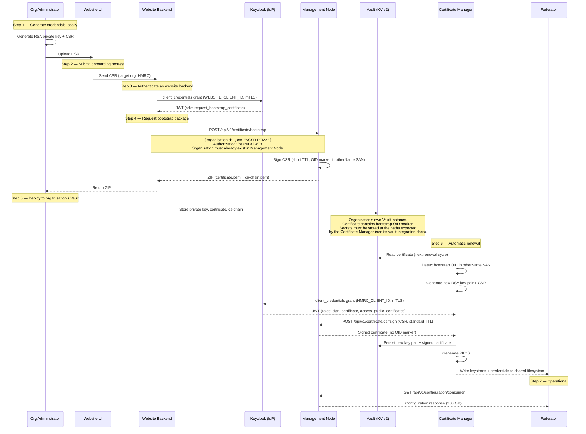

# Bootstrap Onboarding Flow

**Repository:** `management-node`  
**Description:** `End-to-end bootstrap flow for onboarding new organisations with initial certificates`  
**SPDX-License-Identifier:** `Apache-2.0 AND OGL-UK-3.0`  

---

## Overview

Bootstrap onboarding enables new organisations to obtain their initial certificates through a website-mediated flow, without requiring pre-existing mTLS credentials for the target organisation. The organisation's administrator generates a private key and CSR locally, then submits the CSR via the website. The website backend requests a short-lived bootstrap certificate from the Management Node on behalf of the organisation, which is then automatically replaced with a full certificate by the Certificate Manager.

---

## Sequence Diagram

---

## Bootstrap Certificate Properties

| Property | Value | Description |
|----------|-------|-------------|
| TTL | `2h` — `application.bootstrap.ttl`, env `BOOTSTRAP_CERT_TTL` | Limits the window of exposure before automatic renewal |
| OID marker | `1.3.6.1.4.1.32473.1.1` — `application.bootstrap.oid`, env `BOOTSTRAP_OID` | Embedded in an `otherName` SAN entry, used by Certificate Manager to detect bootstrap certificates. Overriding it means updating the Vault role's `allowed_other_sans` to match (see README, PKI setup) |
| Certificate type | `BOOTSTRAP` | Recorded in `organisation_certificate.type`; changes to `AUTOMATED` after renewal |
| `other_sans` format | `<OID>;UTF8:bootstrap` | Vault PKI parameter used when signing the bootstrap CSR |

The OID `1.3.6.1.4.1.32473.1.1` uses the reserved Private Enterprise Number 32473 (RFC 5612, for documentation use). In production, NDTP would register a PEN with IANA and replace this value.

---

## Keycloak Clients

| Client ID | Purpose | Authentication | Roles |
|-----------|---------|----------------|-------|
| `WEBSITE_CLIENT_ID` | Website backend that initiates bootstrap | X.509 client certificate (`client_credentials` grant) | `request_bootstrap_certificate` |
| `HMRC_CLIENT_ID` | Target organisation's federator | X.509 client certificate (`client_credentials` grant) | `sign_certificate`, `access_public_certificates`, `access_consumer_configurations` |

---

## Security Considerations

- The **website backend** is the only actor with the `request_bootstrap_certificate` role. Individual organisations cannot self-bootstrap.
- The bootstrap certificate's **short TTL** limits the window during which the initial certificate is valid.
- The **OID marker** ensures Certificate Manager can distinguish bootstrap certificates from production certificates and trigger immediate renewal. Without it, the certificate would still be renewed but only when it approaches expiry based on the configured renewal threshold.
- All certificate endpoints (`/api/v1/certificate/**`) are **excluded from the CertificateValidationInterceptor**. These endpoints are called by service accounts (e.g. the website backend, Certificate Manager) that may not have an associated organisation certificate record, so organisation certificate validation is not applicable. Access is still secured by JWT authentication and role-based authorization (`@PreAuthorize`).
- After renewal, the replacement certificate is a standard certificate with no OID marker and a normal TTL.
