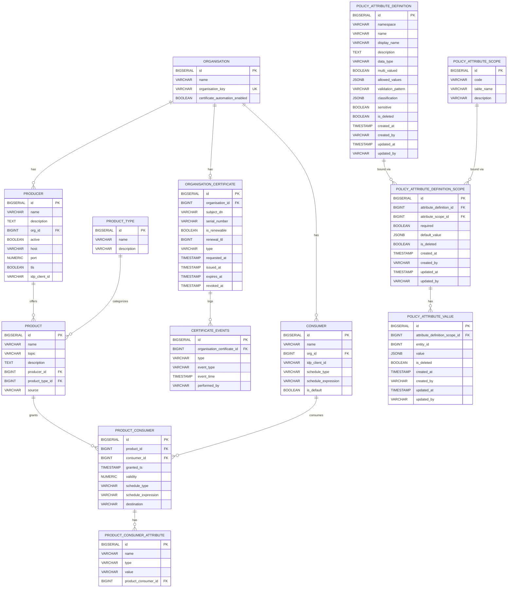

# Database Schema

**Repository:** `management-node`  
**Description:** `Provides APIs to be accessed by Consumer and Producer Federators for the purpose of dynamic configuration management `  
**SPDX-License-Identifier:** `Apache-2.0 AND OGL-UK-3.0 `  

---

This document describes the relational database schema used by the Management Node. The schema is applied via Flyway migrations located at:

- `src/main/resources/db/migration/`

The database is designed to model Organisations, their Producers and Consumers, the Products offered by Producers, and the access grants that allow specific Consumers to access specific Products. Additional attributes can be attached to each grant.

## Overview of Entities and Relationships

- Organisation has many Producers and Consumers
- Organisation has one optional OrganisationCertificate
- OrganisationCertificate has many CertificateEvents
- Producer belongs to an Organisation
- Consumer belongs to an Organisation
- Product belongs to a Producer
- Product ↔ Consumer is a many-to-many relationship implemented via the join table `product_consumer`
- Each `product_consumer` (grant) can have many `product_consumer_attribute` rows for extensible metadata

A simple ER diagram (Mermaid):

---

## Tables

### organisation
Represents an organisation that owns Producers and Consumers.

Columns:
- `id` BIGSERIAL, primary key
- `name` VARCHAR(150), not null
- `organisation_key` VARCHAR(50), not null: stable, human-readable identifier for the organisation (e.g. `ENV`, `BCC`, `HEG`), so callers can address an organisation without depending on ids that differ between environments
- `certificate_automation_enabled` BOOLEAN, not null, default TRUE

Indexes and constraints:
- UNIQUE on `organisation_key` (`uq_organisation__organisation_key`)

Usage:
- Parent entity for `producer`, `consumer`, and `organisation_certificate`.
- `organisation_key` is exposed as `organisation.key` on the producer and consumer configuration APIs.

---

### producer
Represents a Producer federator/service that offers one or more Products.

Columns:
- `id` BIGSERIAL, primary key
- `name` VARCHAR(50), not null
- `description` TEXT, not null
- `org_id` BIGINT, not null, foreign key → `organisation(id)`
- `active` BOOLEAN, not null
- `host` VARCHAR(500), not null: host or base URL where the producer can be reached
- `port` NUMERIC, not null: network port (stored as numeric)
- `tls` BOOLEAN, not null: whether TLS is required for this endpoint
- `idp_client_id` VARCHAR(50), not null: identity provider client id (e.g., Keycloak). Informational; not an FK

Usage:
- Owns `product` records.
- Links an Organisation to concrete connection details for the Producer.

---

### consumer
Represents a Consumer federator/client that requests access to Products.

Columns:
- `id` BIGSERIAL, primary key
- `name` VARCHAR(50), not null
- `org_id` BIGINT, not null, foreign key → `organisation(id)`
- `idp_client_id` VARCHAR(50), not null: identity provider client id (e.g., Keycloak). Informational; not an FK
- `schedule_type` VARCHAR(100), nullable: type of schedule, e.g., `cron`, `interval`
- `schedule_expression` VARCHAR(255), nullable: schedule expression matching the chosen schedule_type
- `is_default` BOOLEAN, not null, default FALSE: whether this consumer takes the subscriptions its organisation requests without naming a consumer

Indexes and constraints:
- Partial UNIQUE index on `org_id` WHERE `is_default = TRUE` (`uq_consumer__one_default_per_org`): an organisation has **at most one** default consumer, and may have none. Constraining only the rows flagged default leaves any number of non-default consumers per organisation legal.

Usage:
- Participates in access grants via `product_consumer`.
- `is_default` is read by `POST /api/v1/product/subscribe` when the request names no consumer. The column is `is_default` rather than `default` because DEFAULT is a reserved word in SQL.
- Optional scheduling metadata for consumer-driven jobs.

---

### product_type
Represents a category/type of Product (e.g., topic-based, file-based).

Columns:
- `id` BIGSERIAL, primary key
- `name` VARCHAR(150), not null
- `description` VARCHAR(255), nullable: brief description of the product type

Usage:
- Lookup table used to categorize products. Initial values seeded by migration: `topic` and `file`.

---

### product
Represents a Product (e.g., a data stream or dataset) offered by a Producer.

Columns:
- `id` BIGSERIAL, primary key
- `name` VARCHAR(50), not null
- `topic` VARCHAR(150), not null: logical topic or channel for the product
- `description` TEXT, nullable: prose describing the product. Together with `name`, this is what discovery's free-text search matches against (`topic` and `source` are identifiers, not prose, and are deliberately not text-searched). Backfilled by data owners; existing rows have none
- `producer_id` BIGINT, not null, foreign key → `producer(id)`
- `product_type_id` BIGINT, nullable, foreign key → `product_type(id)`: categorization of the product
- `source` VARCHAR(500), nullable: optional source identifier/URI for the product

Usage:
- The resource being granted to Consumers via `product_consumer`.
- Migration defaults existing rows to the `topic` product type.

---

### product_consumer
Join table representing an access grant that allows a Consumer to access a Product.

Columns:
- `id` BIGSERIAL, primary key
- `product_id` BIGINT, not null, foreign key → `product(id)`
- `consumer_id` BIGINT, not null, foreign key → `consumer(id)`
- `granted_ts` TIMESTAMP, not null: timestamp when access was granted
- `validity` NUMERIC, not null: validity period/units are application-defined
- `schedule_type` VARCHAR(100), nullable: e.g., `cron`, `interval`
- `schedule_expression` VARCHAR(255), nullable: expression matching the schedule_type
- `destination` VARCHAR(500), nullable: optional destination identifier/URI for scheduled deliveries
- `uq_product_consumer_pair` UNIQUE (`product_id`, `consumer_id`): ensures one grant per pair

Notes:
- Originally used a composite primary key (`product_id`, `consumer_id`); later replaced by surrogate `id` while preserving uniqueness via `uq_product_consumer_pair`.

Usage:
- Central record for authorization decisions: which Consumer can access which Product and since when.
- Optional scheduling metadata for grant-level processing/delivery.
- Written by `POST /api/v1/product/subscribe`, with `validity` set to the validity the `product.subscribe` policy decided from the caller's and the product's attributes. Because `uq_product_consumer_pair` is on (`product_id`, `consumer_id`), one organisation may hold the same product on several of its consumers, while the same consumer cannot hold it twice.

---

### product_consumer_attribute
Extensible attributes attached to a specific `product_consumer` grant (key/value-like rows with a simple type field).

Columns:
- `id` BIGSERIAL, primary key
- `name` VARCHAR(150), not null: attribute name/key
- `type` VARCHAR(50), not null: attribute type (string indicator)
- `value` VARCHAR(500), not null: attribute value
- `product_consumer_id` BIGINT, not null, foreign key → `product_consumer(id)`

Usage:
- Store additional constraints or metadata for a grant (e.g., scopes, rate limits, contractual flags). Semantics are defined by application logic.

---

### organisation_certificate
Tracks the current certificate state for each organisation. Each organisation has at most one certificate record.

Columns:
- `id` BIGSERIAL, primary key
- `organisation_id` BIGINT, not null, unique, foreign key → `organisation(id)`
- `subject_dn` VARCHAR(500), nullable: X.500 distinguished name of the certificate subject
- `serial_number` VARCHAR(150), nullable: certificate serial number
- `is_renewable` BOOLEAN, not null, default FALSE: whether automatic renewal is enabled
- `renewal_ttl` BIGINT, nullable: renewal time-to-live value
- `type` VARCHAR(50), not null: certificate type (e.g., `MANUAL`, `BOOTSTRAP`, `AUTOMATED`)
- `requested_at` TIMESTAMP, nullable: when the certificate was requested
- `issued_at` TIMESTAMP, nullable: when the certificate was issued
- `expires_at` TIMESTAMP, nullable: certificate expiry time
- `revoked_at` TIMESTAMP, nullable: when the certificate was revoked (if applicable)

Constraints:
- UNIQUE on `organisation_id`: one certificate record per organisation
- Index on `organisation_id`

Usage:
- Records the lifecycle state of each organisation's certificate. The `type` field tracks whether the certificate was manually provisioned, issued via the bootstrap flow, or issued via automated renewal.

---

### certificate_events
Audit trail of certificate lifecycle events for each organisation certificate.

Columns:
- `id` BIGSERIAL, primary key
- `organisation_certificate_id` BIGINT, not null, foreign key → `organisation_certificate(id)`
- `type` VARCHAR(50), not null: certificate type at the time of the event
- `event_type` VARCHAR(50), not null: the event that occurred (e.g., `ISSUED`, `RENEWED`, `EXPIRED`, `REVOKED`)
- `event_time` TIMESTAMP, not null: when the event occurred
- `performed_by` VARCHAR(255), nullable: identifier of the actor who triggered the event

Constraints:
- Index on `organisation_certificate_id`

Usage:
- Provides an audit log of all certificate lifecycle transitions. Each event captures what happened, when, and who performed the action.

---

### policy_attribute_scope
Which core entity types may carry dynamic policy attributes, and the table `policy_attribute_value.entity_id` resolves against for that scope.

Columns:
- `id` BIGSERIAL, primary key
- `code` VARCHAR(50), not null: unique scope identifier (e.g. `PRODUCT`)
- `table_name` VARCHAR(150), not null: the table `policy_attribute_value.entity_id` is a row id in, for this scope
- `description` VARCHAR(500), nullable

Constraints:
- UNIQUE on `code` (`uq_policy_attribute_scope__code`)

Usage:
- Seeded by migration with one row per core entity type: `ORGANISATION` (`organisation`), `CONSUMER` (`consumer`), `PRODUCER` (`producer`), `PRODUCT` (`product`), `SUBSCRIPTION` (`product_consumer`).
- Referenced by `policy_attribute_definition_scope` to say which scopes an attribute definition applies to.

---

### policy_attribute_definition
Vocabulary of policy attributes: name, type, and validation metadata, independent of which scope(s) it applies to.

Columns:
- `id` BIGSERIAL, primary key
- `namespace` VARCHAR(150), not null
- `name` VARCHAR(150), not null
- `display_name` VARCHAR(255), nullable
- `description` TEXT, not null
- `data_type` VARCHAR(50), not null
- `multi_valued` BOOLEAN, not null, default FALSE
- `allowed_values` JSONB, nullable
- `validation_pattern` VARCHAR(500), nullable
- `classification` JSONB, nullable
- `sensitive` BOOLEAN, not null, default FALSE
- `is_deleted` BOOLEAN, not null, default FALSE
- `created_at` TIMESTAMP, not null, default `now()`
- `created_by` VARCHAR(255), not null
- `updated_at` TIMESTAMP, nullable
- `updated_by` VARCHAR(255), nullable

Constraints:
- UNIQUE on (`namespace`, `name`) (`uq_policy_attribute_definition__namespace_name`)

Usage:
- Defines the shape of a policy attribute (e.g. data type, whether it can hold multiple values, allowed values, sensitivity) independently of where it can be attached.

---

### policy_attribute_definition_scope
Which scopes a `policy_attribute_definition` is valid on, whether required there, and its default value.

Columns:
- `id` BIGSERIAL, primary key
- `attribute_definition_id` BIGINT, not null, foreign key → `policy_attribute_definition(id)`
- `attribute_scope_id` BIGINT, not null, foreign key → `policy_attribute_scope(id)`
- `required` BOOLEAN, not null, default FALSE
- `default_value` JSONB, nullable
- `is_deleted` BOOLEAN, not null, default FALSE
- `created_at` TIMESTAMP, not null, default `now()`
- `created_by` VARCHAR(255), not null
- `updated_at` TIMESTAMP, nullable
- `updated_by` VARCHAR(255), nullable

Constraints:
- UNIQUE on (`attribute_definition_id`, `attribute_scope_id`) (`uq_policy_attribute_definition_scope__definition_scope`)
- Index on `attribute_definition_id` (`idx_policy_attribute_definition_scope__attribute_definition_id`)
- Index on `attribute_scope_id` (`idx_policy_attribute_definition_scope__attribute_scope_id`)

Usage:
- Binds a definition to one or more scopes, controlling per-scope requiredness and default.

---

### policy_attribute_value
Actual policy attribute values recorded against a specific entity.

Columns:
- `id` BIGSERIAL, primary key
- `attribute_definition_scope_id` BIGINT, not null, foreign key → `policy_attribute_definition_scope(id)`
- `entity_id` BIGINT, not null. Polymorphic reference: the primary key of the row in the table named by the value's `policy_attribute_scope.table_name`. Not a declared foreign key, since the target table varies by scope.
- `value` JSONB, not null
- `is_deleted` BOOLEAN, not null, default FALSE
- `created_at` TIMESTAMP, not null, default `now()`
- `created_by` VARCHAR(255), not null
- `updated_at` TIMESTAMP, nullable
- `updated_by` VARCHAR(255), nullable

Constraints:
- Index on `entity_id` (`idx_policy_attribute_value__entity_id`)
- Partial UNIQUE index on (`attribute_definition_scope_id`, `entity_id`, `value`) WHERE `is_deleted = FALSE` (`uq_policy_attr_value_live`): an idempotency guard against persisting an exact-duplicate live value; it does not by itself enforce "one live value per entity" for single-valued attributes (that check spans `policy_attribute_definition.multi_valued` and is left to the service layer that writes these rows)

Attribute values are not cleaned up by the database:
- `V20260922120000__drop_policy_attribute_soft_delete_trigger.sql` removed the five `AFTER DELETE` triggers (`organisation`, `consumer`, `producer`, `product`, `product_consumer`) and the shared function `fn_policy_attribute_value_soft_delete_on_entity_delete()`. The function resolved its table names unqualified, so PL/pgSQL resolved them against the **caller's** `search_path`; a session without the schema on its path could not delete from any owning table at all.
- **`entity_id` has no foreign key and no cascade** (it is polymorphic, see above), so nothing now marks an entity's attribute values `is_deleted` when the entity is removed. Whatever deletes one of those entities is responsible for soft-deleting its `policy_attribute_value` rows in the same transaction.
- Live rows left behind remain visible through `policy_attribute_live_value` and are still matched by `entity_id`, so they can reach a policy decision for an entity that no longer exists.

Usage:
- Stores the actual attribute values sent to the PDP (OPA) for policy decisions, keyed by which entity (organisation, consumer, producer, product, or subscription) they describe. Live rows are read per request and embedded in the decision input as `subject.organisation.attributes` (resolved from the token's organisation claim via `organisation_key`) and `resource.attributes`; the `value` JSONB keeps its type. A `multi_valued` attribute is stored as one row per value and all of its live rows are collected into a single array for the policy, so the partial unique index above (which permits many distinct live values per entity) is what makes multiple values possible. See [Policy Enforcement](POLICY_ENFORCEMENT.md).

---

### policy_attribute_live_value (view)

One row per **live** policy attribute value, already joined to its definition and scope, so a query can ask "does this entity carry attribute X with value Y" without repeating four joins. "Live" means neither the value, its definition, nor its scope binding is soft-deleted.

Columns:
- `scope_code`: the owning `policy_attribute_scope.code` (`PRODUCT`, `ORGANISATION`, …)
- `entity_id`: the row id, in the table that scope names, the value is recorded against
- `namespace`, `name`: the attribute's definition
- `multi_valued`, `sensitive`: flags from the definition
- `item`: one value as text (`'validated'`, `'42'`, `'true'`)
- `item_type`: its JSON type (`string`, `number`, `boolean`), so a caller can compare it typed

A multi-valued attribute is normally stored as one row per value, but a single row holding a JSON array is also accepted; **both conventions are flattened here**, so either way the view yields one row per value.

Usage:
- Product discovery builds its `WHERE` clause from this view (an attribute comparison compiles to an `EXISTS` over it, with the attribute *name* as a bound parameter, which is why a new attribute needs no code change) and loads each response's attribute maps from it, with masked and sensitive names excluded in SQL.

## Migration Notes
- Schema is versioned and applied with Flyway on application startup.
- Foreign keys enforce referential integrity among core entities.
- Foreign key columns are not indexed automatically by PostgreSQL. The ones product discovery joins on every search are indexed by `V20260918122000__add_product_discovery_indexes.sql`: `product.producer_id`, `producer.org_id`, `product_consumer.product_id` and `consumer.org_id`. Consider the same for `product_consumer.consumer_id` and `product_consumer_attribute.product_consumer_id` if query plans show it.
- Discovery's free-text search is a leading-wildcard `LIKE` over `product.name` and `product.description`, which no b-tree index can serve. A `pg_trgm` GIN index is the remedy if `EXPLAIN` shows it is needed; `CREATE EXTENSION` needs a privileged role, so agree it with whoever owns the database.

## Data Protection and Security
- Identity fields like `idp_client_id` are not foreign keys; they link to external IdP configuration (e.g., Keycloak) at the application layer.
- Ensure that any PII or sensitive metadata stored in attributes follows your organization’s data handling policies.
