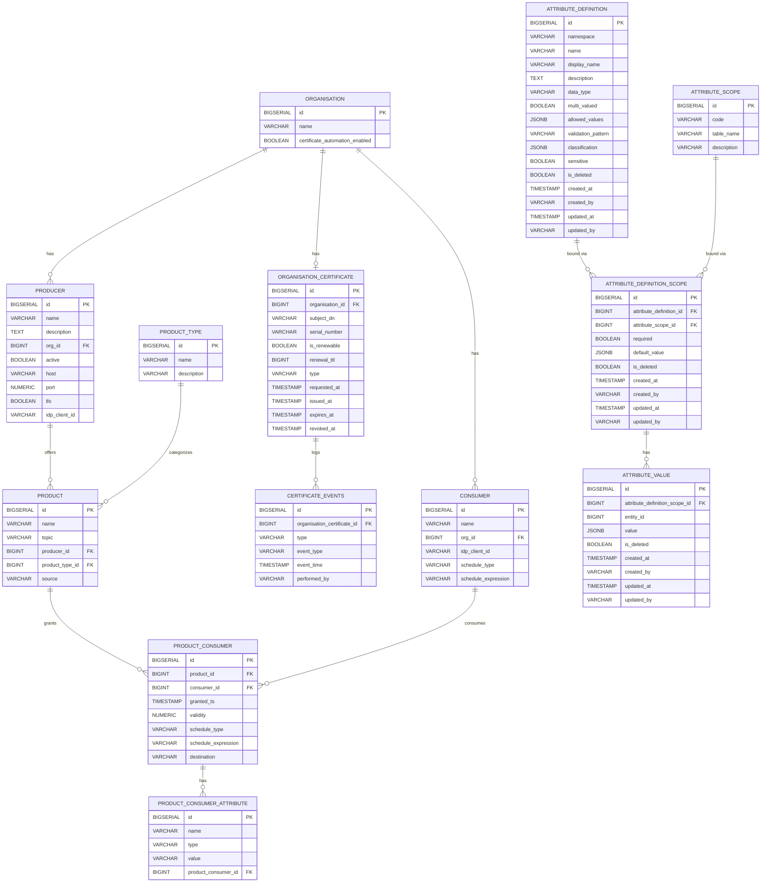

# Database Schema

**Repository:** `management-node`  
**Description:** `Provides APIs to be accessed by Consumer and Producer Federators for the purpose of dynamic configuration management `  
**SPDX-License-Identifier:** `Apache-2.0 AND OGL-UK-3.0 `  

---

This document describes the relational database schema used by the Management Node. The schema is applied via Flyway migrations located at:

- `src/main/resources/db/migration/`

The database is designed to model Organisations, their Producers and Consumers, the Products offered by Producers, and the access grants that allow specific Consumers to access specific Products. Additional attributes can be attached to each grant.

## Overview of Entities and Relationships

- Organisation has many Producers and Consumers
- Organisation has one optional OrganisationCertificate
- OrganisationCertificate has many CertificateEvents
- Producer belongs to an Organisation
- Consumer belongs to an Organisation
- Product belongs to a Producer
- Product ↔ Consumer is a many-to-many relationship implemented via the join table `product_consumer`
- Each `product_consumer` (grant) can have many `product_consumer_attribute` rows for extensible metadata

A simple ER diagram (Mermaid):

---

## Tables

### organisation
Represents an organisation that owns Producers and Consumers.

Columns:
- `id` BIGSERIAL, primary key
- `name` VARCHAR(150), not null
- `certificate_automation_enabled` BOOLEAN, not null, default TRUE

Usage:
- Parent entity for `producer`, `consumer`, and `organisation_certificate`.

---

### producer
Represents a Producer federator/service that offers one or more Products.

Columns:
- `id` BIGSERIAL, primary key
- `name` VARCHAR(50), not null
- `description` TEXT, not null
- `org_id` BIGINT, not null, foreign key → `organisation(id)`
- `active` BOOLEAN, not null
- `host` VARCHAR(500), not null — host or base URL where the producer can be reached
- `port` NUMERIC, not null — network port (stored as numeric)
- `tls` BOOLEAN, not null — whether TLS is required for this endpoint
- `idp_client_id` VARCHAR(50), not null — identity provider client id (e.g., Keycloak). Informational; not an FK

Usage:
- Owns `product` records.
- Links an Organisation to concrete connection details for the Producer.

---

### consumer
Represents a Consumer federator/client that requests access to Products.

Columns:
- `id` BIGSERIAL, primary key
- `name` VARCHAR(50), not null
- `org_id` BIGINT, not null, foreign key → `organisation(id)`
- `idp_client_id` VARCHAR(50), not null — identity provider client id (e.g., Keycloak). Informational; not an FK
- `schedule_type` VARCHAR(100), nullable — type of schedule, e.g., `cron`, `interval`
- `schedule_expression` VARCHAR(255), nullable — schedule expression matching the chosen schedule_type

Usage:
- Participates in access grants via `product_consumer`.
- Optional scheduling metadata for consumer-driven jobs.

---

### product_type
Represents a category/type of Product (e.g., topic-based, file-based).

Columns:
- `id` BIGSERIAL, primary key
- `name` VARCHAR(150), not null
- `description` VARCHAR(255), nullable — brief description of the product type

Usage:
- Lookup table used to categorize products. Initial values seeded by migration: `topic` and `file`.

---

### product
Represents a Product (e.g., a data stream or dataset) offered by a Producer.

Columns:
- `id` BIGSERIAL, primary key
- `name` VARCHAR(50), not null
- `topic` VARCHAR(150), not null — logical topic or channel for the product
- `producer_id` BIGINT, not null, foreign key → `producer(id)`
- `product_type_id` BIGINT, nullable, foreign key → `product_type(id)` — categorization of the product
- `source` VARCHAR(500), nullable — optional source identifier/URI for the product

Usage:
- The resource being granted to Consumers via `product_consumer`.
- Migration defaults existing rows to the `topic` product type.

---

### product_consumer
Join table representing an access grant that allows a Consumer to access a Product.

Columns:
- `id` BIGSERIAL, primary key
- `product_id` BIGINT, not null, foreign key → `product(id)`
- `consumer_id` BIGINT, not null, foreign key → `consumer(id)`
- `granted_ts` TIMESTAMP, not null — timestamp when access was granted
- `validity` NUMERIC, not null — validity period/units are application-defined
- `schedule_type` VARCHAR(100), nullable — e.g., `cron`, `interval`
- `schedule_expression` VARCHAR(255), nullable — expression matching the schedule_type
- `destination` VARCHAR(500), nullable — optional destination identifier/URI for scheduled deliveries
- `uq_product_consumer_pair` UNIQUE (`product_id`, `consumer_id`) — ensures one grant per pair

Notes:
- Originally used a composite primary key (`product_id`, `consumer_id`); later replaced by surrogate `id` while preserving uniqueness via `uq_product_consumer_pair`.

Usage:
- Central record for authorization decisions: which Consumer can access which Product and since when.
- Optional scheduling metadata for grant-level processing/delivery.

---

### product_consumer_attribute
Extensible attributes attached to a specific `product_consumer` grant (key/value-like rows with a simple type field).

Columns:
- `id` BIGSERIAL, primary key
- `name` VARCHAR(150), not null — attribute name/key
- `type` VARCHAR(50), not null — attribute type (string indicator)
- `value` VARCHAR(500), not null — attribute value
- `product_consumer_id` BIGINT, not null, foreign key → `product_consumer(id)`

Usage:
- Store additional constraints or metadata for a grant (e.g., scopes, rate limits, contractual flags). Semantics are defined by application logic.

---

### organisation_certificate
Tracks the current certificate state for each organisation. Each organisation has at most one certificate record.

Columns:
- `id` BIGSERIAL, primary key
- `organisation_id` BIGINT, not null, unique, foreign key → `organisation(id)`
- `subject_dn` VARCHAR(500), nullable — X.500 distinguished name of the certificate subject
- `serial_number` VARCHAR(150), nullable — certificate serial number
- `is_renewable` BOOLEAN, not null, default FALSE — whether automatic renewal is enabled
- `renewal_ttl` BIGINT, nullable — renewal time-to-live value
- `type` VARCHAR(50), not null — certificate type (e.g., `MANUAL`, `BOOTSTRAP`, `AUTOMATED`)
- `requested_at` TIMESTAMP, nullable — when the certificate was requested
- `issued_at` TIMESTAMP, nullable — when the certificate was issued
- `expires_at` TIMESTAMP, nullable — certificate expiry time
- `revoked_at` TIMESTAMP, nullable — when the certificate was revoked (if applicable)

Constraints:
- UNIQUE on `organisation_id` — one certificate record per organisation
- Index on `organisation_id`

Usage:
- Records the lifecycle state of each organisation's certificate. The `type` field tracks whether the certificate was manually provisioned, issued via the bootstrap flow, or issued via automated renewal.

---

### certificate_events
Audit trail of certificate lifecycle events for each organisation certificate.

Columns:
- `id` BIGSERIAL, primary key
- `organisation_certificate_id` BIGINT, not null, foreign key → `organisation_certificate(id)`
- `type` VARCHAR(50), not null — certificate type at the time of the event
- `event_type` VARCHAR(50), not null — the event that occurred (e.g., `ISSUED`, `RENEWED`, `EXPIRED`, `REVOKED`)
- `event_time` TIMESTAMP, not null — when the event occurred
- `performed_by` VARCHAR(255), nullable — identifier of the actor who triggered the event

Constraints:
- Index on `organisation_certificate_id`

Usage:
- Provides an audit log of all certificate lifecycle transitions. Each event captures what happened, when, and who performed the action.

---

### attribute_scope
Which core entity types may carry dynamic policy attributes, and the table `attribute_value.entity_id` resolves against for that scope.

Columns:
- `id` BIGSERIAL, primary key
- `code` VARCHAR(50), not null — unique scope identifier (e.g. `PRODUCT`)
- `table_name` VARCHAR(150), not null — the table `attribute_value.entity_id` is a row id in, for this scope
- `description` VARCHAR(500), nullable

Constraints:
- UNIQUE on `code` (`uq_attribute_scope__code`)

Usage:
- Seeded by migration with one row per core entity type: `ORGANISATION` (`organisation`), `CONSUMER` (`consumer`), `PRODUCER` (`producer`), `PRODUCT` (`product`), `SUBSCRIPTION` (`product_consumer`).
- Referenced by `attribute_definition_scope` to say which scopes an attribute definition applies to.

---

### attribute_definition
Vocabulary of policy attributes: name, type, and validation metadata, independent of which scope(s) it applies to.

Columns:
- `id` BIGSERIAL, primary key
- `namespace` VARCHAR(150), not null
- `name` VARCHAR(150), not null
- `display_name` VARCHAR(255), nullable
- `description` TEXT, not null
- `data_type` VARCHAR(50), not null
- `multi_valued` BOOLEAN, not null, default FALSE
- `allowed_values` JSONB, nullable
- `validation_pattern` VARCHAR(500), nullable
- `classification` JSONB, nullable
- `sensitive` BOOLEAN, not null, default FALSE
- `is_deleted` BOOLEAN, not null, default FALSE
- `created_at` TIMESTAMP, not null, default `now()`
- `created_by` VARCHAR(255), not null
- `updated_at` TIMESTAMP, nullable
- `updated_by` VARCHAR(255), nullable

Constraints:
- UNIQUE on (`namespace`, `name`) (`uq_attribute_definition__namespace_name`)

Usage:
- Defines the shape of a policy attribute (e.g. data type, whether it can hold multiple values, allowed values, sensitivity) independently of where it can be attached.

---

### attribute_definition_scope
Which scopes an `attribute_definition` is valid on, whether required there, and its default value.

Columns:
- `id` BIGSERIAL, primary key
- `attribute_definition_id` BIGINT, not null, foreign key → `attribute_definition(id)`
- `attribute_scope_id` BIGINT, not null, foreign key → `attribute_scope(id)`
- `required` BOOLEAN, not null, default FALSE
- `default_value` JSONB, nullable
- `is_deleted` BOOLEAN, not null, default FALSE
- `created_at` TIMESTAMP, not null, default `now()`
- `created_by` VARCHAR(255), not null
- `updated_at` TIMESTAMP, nullable
- `updated_by` VARCHAR(255), nullable

Constraints:
- UNIQUE on (`attribute_definition_id`, `attribute_scope_id`) (`uq_attribute_definition_scope__definition_scope`)
- Index on `attribute_definition_id` (`idx_attribute_definition_scope__attribute_definition_id`)
- Index on `attribute_scope_id` (`idx_attribute_definition_scope__attribute_scope_id`)

Usage:
- Binds a definition to one or more scopes, controlling per-scope requiredness and default.

---

### attribute_value
Actual policy attribute values recorded against a specific entity.

Columns:
- `id` BIGSERIAL, primary key
- `attribute_definition_scope_id` BIGINT, not null, foreign key → `attribute_definition_scope(id)`
- `entity_id` BIGINT, not null — polymorphic reference: the primary key of the row in the table named by the value's `attribute_scope.table_name`. Not a declared foreign key, since the target table varies by scope.
- `value` JSONB, not null
- `is_deleted` BOOLEAN, not null, default FALSE
- `created_at` TIMESTAMP, not null, default `now()`
- `created_by` VARCHAR(255), not null
- `updated_at` TIMESTAMP, nullable
- `updated_by` VARCHAR(255), nullable

Constraints:
- Index on `entity_id` (`idx_attribute_value__entity_id`)
- Partial UNIQUE index on (`attribute_definition_scope_id`, `entity_id`, `value`) WHERE `is_deleted = FALSE` (`uq_attr_value_live`) — an idempotency guard against persisting an exact-duplicate live value; it does not by itself enforce "one live value per entity" for single-valued attributes (that check spans `attribute_definition.multi_valued` and is left to the service layer that writes these rows)

Soft-delete triggers:
- `trg_organisation_attribute_value_soft_delete`, `trg_consumer_attribute_value_soft_delete`, `trg_producer_attribute_value_soft_delete`, `trg_product_attribute_value_soft_delete`, `trg_product_consumer_attribute_value_soft_delete` — one `AFTER DELETE` trigger per owning table (`organisation`, `consumer`, `producer`, `product`, `product_consumer`), all calling the shared function `fn_attribute_value_soft_delete_on_entity_delete()`. When a row in one of those tables is deleted, every live (`is_deleted = FALSE`) `attribute_value` row scoped to that table and entity id is set `is_deleted = TRUE` rather than deleted or left orphaned.

Usage:
- Stores the actual attribute values used to build the OPA data bundle for policy decisions, keyed by which entity (organisation, consumer, producer, product, or subscription) they describe.

---

## Migration Notes
- Schema is versioned and applied with Flyway on application startup.
- Foreign keys enforce referential integrity among core entities.
- Consider adding database indexes on foreign key columns (`producer.producer_id`, `consumer.org_id`, `product.producer_id`, `product_consumer.product_id`, `product_consumer.consumer_id`, `product_consumer_attribute.product_consumer_id`) to optimize query performance.

## Data Protection and Security
- Identity fields like `idp_client_id` are not foreign keys; they link to external IdP configuration (e.g., Keycloak) at the application layer.
- Ensure that any PII or sensitive metadata stored in attributes follows your organization’s data handling policies.
